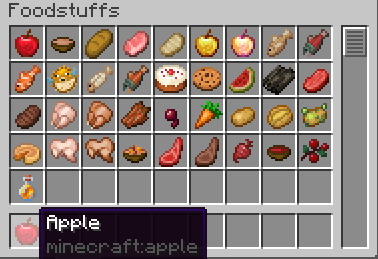

# Replenish (Fabric)

This mod is inspired by [Xaero's Better PVP Mod](https://chocolateminecraft.com/betterpvp2.php).
Specifically the feature of eating food with single key. 
So I've written my implementation with some additional QOL features.

## Features
- An eating food with single key press
- Include potions
- Configurable list of items to be ignored
- Clear status effect key
- [Mod Menu](https://github.com/TerraformersMC/ModMenu) integration

## How to use
- Use `R` (default key) to find food in your hotbar and eat it
- Config can be found at `%appdata%/.minecraft/config/replenish.toml`

### Option descriptions
- `Ignore food with harmful effect/s` (default **false**) : When set to true it will skip or not eat food with harmful status effect/s (e.g., spider eye, puffer fish...)
- `Include potions` (default **false**) : Potions will be added to the list of things that can be used with your replenish key (doesn't check for harmful effect/s)
- `Ignore food/potion harmful effect/s` (default **true**) : Add food/potion item id you want its harmful effect/s to be ignored (default added rotten flesh and raw chicken). Item ids can be found at [DigMinecraft](https://www.digminecraft.com/lists/item_id_list_pc.php) or in game when tooltips are shown (F3 + H) 

## Troubleshooting
- If item that is not used or ignored in custom lists recheck item ID added.